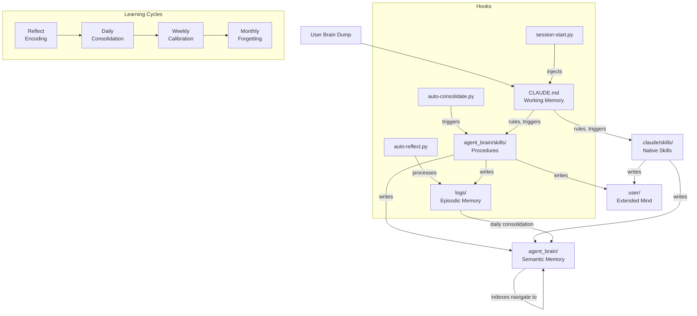
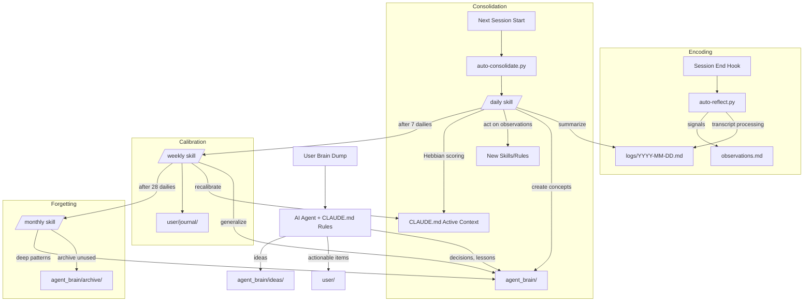

# Agentic Buddy

> Persistent file-based memory system for AI coding assistants -- captures, organizes, and maintains user context across sessions using Markdown files, automatic learning cycles, and Hebbian visibility management.

- **Type:** AI agent memory framework (platform-agnostic)
- **Primary language:** Markdown (content), Python (hooks), Bash (commands)
- **Key frameworks:** Cursor hooks API, Claude Code hooks API, Git
- **Status:** Active development -- created by Juanje Ojeda, ~4 months old. Actively used in production daily.

## Contents

- [Architecture Overview](#architecture-overview)
- [Project Structure](#project-structure)
- [Key Components](#key-components)
- [Data Flow](#data-flow)
- [External Integrations](#external-integrations)
- [Development Guide](#development-guide)
- [Critical Paths & Gotchas](#critical-paths--gotchas)

## Architecture Overview

Four-zone cognitive architecture modeled on biological memory systems. `CLAUDE.md` is working memory (always loaded). `agent_brain/` is semantic memory (on-demand via indexes). `logs/` is episodic memory (processing buffer consolidated into semantic memory). `user/` is the extended mind (user-owned workspace, never auto-pruned).

Three Python hooks drive automatic maintenance: `session-start.py` injects identity and context on startup, `auto-reflect.py` processes conversations into logs on session end (and periodically), and `auto-consolidate.py` triggers daily/weekly/monthly learning cycles based on usage thresholds. All hooks work in both Cursor and Claude Code via environment detection (`CURSOR_PROJECT_DIR` env var). Both `auto-reflect.py` and `auto-consolidate.py` set `AB_MAINTENANCE=1` on spawned agents and check it on entry to prevent recursive hook triggering.

Hook wiring is platform-specific: Cursor uses `.cursor/hooks.json` (events: `sessionStart`, `sessionEnd`, `afterAgentResponse`), Claude Code uses `.claude/settings.json` hooks section (events: `SessionStart`, `SessionEnd`, `Stop`). The Python hooks normalize these differences internally -- `auto-reflect.py` treats `afterAgentResponse`/`Stop` as periodic events and `sessionEnd`/`SessionEnd`/`preCompact`/`PreCompact` as forced events.

Skills exist in two forms: Markdown procedures in `agent_brain/skills/` (15 skills, triggered by conversation patterns), and Claude Code native skills in `.claude/skills/` (3 skills, with their own `SKILL.md` format). Both are indexed in CLAUDE.md's Skills section and loaded on demand when triggers match.

Stateful report agents (manager report, PitCrew, Core RPMs Redux, LP status, QC, methodology) maintain per-agent knowledge bases in `agent_brain/projects/<agent-name>/` with `index.md` hubs, active snapshots, history directories, and optionally a computed store (script-only, never LLM-generated).

### System Diagram



### Design Patterns
- **Hebbian plasticity**: Files track `access_count` and `last_accessed` metadata. The learning cycles promote frequently-accessed files through 5 visibility levels (subdirectory entry -> directory index -> parent index -> "Where to find things" -> Active context) and demote unused ones. Staleness is measured in active sessions, not calendar days.
- **Progressive disclosure**: Agent reads `index.md` files before opening specific files. Only `CLAUDE.md` + `SOUL.md` + `USER.md` + last log + deferred alert are loaded at startup -- everything else on demand.
- **Four-store memory** (per agent-forge design principles): active store (current snapshot), history store (versioned past states), reference store (static domain knowledge), and computed store (script-generated stats, never LLM). Implemented in stateful report agents under `agent_brain/projects/<agent>/`.
- **Implicit connectivity**: File importance emerges from how many other files organically link to it (functional links only -- no mandatory backlinks). This mirrors neural network activation patterns.

### Key Architectural Decisions
- **Plain Markdown over databases/embeddings**: Human-readable, Git-versionable, portable across any AI agent. If the agent breaks, knowledge survives in readable files.
- **Usage-based thresholds over calendar dates**: Consolidation cycles trigger after N dailies/sessions, not after N days. A week of vacation doesn't trigger unnecessary maintenance.
- **Semantic memory never deleted**: Concepts and ideas stay in the hierarchy (depth is cooling). Only procedural memory (unused skills >3 months) and operational state (completed projects) can be archived.
- **Computed store separation**: Data that can be derived from raw inputs (statistics, tallies) is generated by Python scripts, not by the LLM. This prevents hallucinated numbers. See `agent_brain/projects/methodology-agent/computed/compute_stats.py`.

## Project Structure

```
agentic-buddy/
├── CLAUDE.md                    -> agent working memory (always loaded)
├── README.md                    -- comprehensive project documentation
├── agent_brain/
│   ├── identity/
│   │   ├── SOUL.md              -- agent character traits and interaction style
│   │   └── USER.md              -- user profile, preferences, context
│   ├── observations.md          -- learning journal (raw signals from reflect)
│   ├── deferred.md              -- reminder items deferred for future dates
│   ├── skills/                  -- 15 reusable procedures (Markdown format)
│   ├── projects/                -- project context, decisions, agent knowledge bases
│   │   ├── index.md             -- project directory map
│   │   ├── <topic>.md           -- standalone project files
│   │   ├── mr-agent/            -- manager report agent (active/history/reference)
│   │   ├── pitcrew-agent/       -- PitCrew/RHAS report agent
│   │   ├── core-rpms-redux-agent/ -- Core RPMs Redux report agent
│   │   ├── lp-status-agent/     -- RHIVOS QC LP status agent
│   │   ├── qc-agent/            -- quarterly connection agent
│   │   ├── methodology-agent/   -- AI methodology agent (includes computed/ store)
│   │   ├── talent-architecture/ -- talent framework reference + active briefs
│   │   └── rhas-testing-ownership/ -- RHAS testing initiative analysis
│   ├── concepts/                -- lessons learned, patterns, generalized knowledge
│   │   └── index.md             -- concept directory map
│   ├── ideas/                   -- idea lifecycle (seed -> developing -> ready -> converted)
│   └── archive/                 -- degraded files (procedural/operational only)
├── logs/
│   ├── index.md                 -- session registry (date, type, themes)
│   ├── YYYY-MM-DD.md            -- daily logs (last 28 kept)
│   └── archive/YYYY-MM/         -- older logs grouped by month
├── user/                        -- user workspace (action items, drafts, reports)
│   ├── ai-sessions.md           -- Claude/AI session IDs by working directory and date
│   ├── local-agents.md          -- AI agents available on this workstation
│   ├── reports/                 -- generated HTML reports (manager, PitCrew, LP, etc.)
│   ├── learning/                -- learning materials and references
│   └── journal/
│       ├── weekly/              -- weekly summaries
│       └── monthly/             -- monthly summaries
├── docs/                        -- generated documentation (this file)
├── .cursor/
│   ├── commands/                -- slash commands (daily, weekly, monthly, reflect, etc.)
│   ├── hooks.json               -- Cursor platform hook wiring (event-to-script mapping)
│   └── hooks/
│       ├── session-start.py     -> sessionStart hook
│       ├── auto-reflect.py      -> session end + periodic hook
│       ├── auto-consolidate.py  -> sessionStart hook (cycle trigger)
│       └── config.json          -- hook configuration (thresholds, enable toggles)
├── .claude/
│   ├── commands/                -- symlink -> ../.cursor/commands
│   ├── hooks/                   -- symlink -> ../.cursor/hooks
│   ├── skills/                  -- Claude Code native skills (SKILL.md format)
│   │   ├── process-1on1s/       -- 1:1 Google Doc processing
│   │   ├── project-pulse/       -- cross-reference Slack vs project files
│   │   └── scan-slack-channels/ -- Slack channel activity scanner
│   ├── settings.json            -- Claude Code project permissions + hook definitions
│   ├── settings.local.json      -- local-only permission overrides
│   └── scheduled_tasks.json     -- cron-like scheduled tasks
├── .packs/                      -- domain starter kits (work, personal, writing)
└── templates/
    └── CLAUDE.md                -- template for new instances
```

## Key Components

### CLAUDE.md (Working Memory)
**Location:** `CLAUDE.md`
**Purpose:** Single entry point for the AI agent -- loaded automatically every session

Contains: core behavior rules (capture routing, metadata, commit discipline), active context (current state, hot files), directory index ("Where to find things" with triggers), and skills index (procedures with triggers). This is the agent's working memory -- everything it needs to know without opening additional files.

### Python Hooks
**Location:** `.cursor/hooks/` (symlinked from `.claude/hooks/`)
**Purpose:** Automatic session lifecycle management

**Key files:**
- `session-start.py` -- `main()` reads and concatenates up to 5 items into `additional_context`: `SOUL.md`, `USER.md`, `logs/index.md`, last active log (date parsed from index.md "active" lines), and a deferred-items alert from `deferred.md` (counts pending items, emits warning if any exist). Outputs JSON for both Cursor (`additional_context` key) and Claude Code (`hookSpecificOutput` wrapper). Platform detected via `CURSOR_PROJECT_DIR` env var.
- `auto-reflect.py` -- `main()` detects platform (Cursor vs Claude Code), filters the JSONL conversation transcript (stripping system messages), inserts a `NEW SEGMENT` marker for incremental processing (splitting at `last_processed_line` stored in per-conversation state files under `.cursor/hooks/.state/<conversation_id>.json`), and spawns a background agent with the `process-conversation` skill. Fires on session end (forced events: `sessionEnd`/`SessionEnd`, `preCompact`/`PreCompact`) and periodically every N agent responses (default 10, periodic events: `afterAgentResponse` on Cursor, `Stop` on Claude Code). Uses PID-based locking (`.cursor/hooks/.state/reflect.lock`) to prevent concurrent reflects. Sets `AB_MAINTENANCE=1` env var on spawned agents to prevent recursive hook triggering.
- `auto-consolidate.py` -- `main()` checks usage-based thresholds and spawns a background agent to run the highest due cycle (priority: monthly > weekly > daily). State persisted in `.cursor/hooks/.state/consolidate.json`, tracking last run dates and cycle counters (`dailies_since_weekly`, `dailies_since_monthly`, `weeklies_since_monthly`). Alt monthly path: 21+ dailies AND 3+ weeklies. Uses PID-based locking (`.cursor/hooks/.state/consolidate.lock`) to prevent concurrent consolidation runs. Checks `AB_MAINTENANCE=1` to avoid running inside maintenance agents.
- `config.json` -- toggle fields: `reflect_enabled`, `consolidation_enabled`, `auto_reflect_threshold` (reflect every N agent responses, default 10). Cycle timing thresholds have defaults hardcoded in `auto-consolidate.py` but are overridable via config keys: `daily_hours_threshold` (default 24), `weekly_dailies_threshold` (default 7), `monthly_dailies_threshold` (default 28), `monthly_dailies_alt_threshold` (default 21), `monthly_weeklies_alt_threshold` (default 3).

### Skills System
**Location:** `agent_brain/skills/` (Markdown procedures) and `.claude/skills/` (Claude Code native)
**Purpose:** Reusable multi-step procedures triggered by commands or conversation patterns

Two skill formats coexist:
- **Markdown skills** (`agent_brain/skills/`) -- frontmatter (metadata), "When to use" (trigger patterns), and "Procedure" (numbered steps). 15 skills total.
- **Claude Code native skills** (`.claude/skills/`) -- `SKILL.md` files in subdirectories, using Claude Code's built-in skill framework. 3 skills: `scan-slack-channels`, `process-1on1s`, `project-pulse`.

Both formats are indexed in CLAUDE.md's Skills section -- the agent reads the full skill file only when a trigger matches.

**Core learning cycle skills (4):**
- `process-conversation.md` -- encoding: logs decisions/tasks/ideas/lessons, detects observations (skill/rule/concept candidates), patches stale active context
- `daily-consolidation.md` -- consolidation: day summary, concept creation, association formation, act on mature observations (2+ occurrences), Hebbian promotion/demotion, log rotation (28-file window)
- `weekly-review.md` -- calibration: compile weekly summary, review ideas lifecycle, link hygiene, Hebbian recalibration across all 5 levels, generalization (specific -> general concepts), light pruning flags
- `monthly-maintenance.md` -- forgetting: deep pruning, archival of abandoned procedural/operational files, contradiction detection, structural review

**Report agent skills (6):** Engineering manager report, PitCrew/RHAS status, Core RPMs Redux status, RHIVOS QC LP status, quarterly connection evaluations, AI methodology tracking. Each maintains a stateful knowledge base under `agent_brain/projects/`.

**Utility skills (5):** `mr-capture` (mid-cycle observations for manager report), `update-upstream` (template sync), `talent-development` (1:1 prep with career framework), `person-slack-lookup` (search a person's Slack activity), `atc-release-compose` (trigger/monitor ODCS release builds).

### Agent Knowledge Bases
**Location:** `agent_brain/projects/<agent-name>/`
**Purpose:** Persistent state for stateful report agents

Each knowledge base follows a consistent structure:
- `index.md` -- hub file describing contents and when to read
- `active/` -- current snapshot (latest report data, running tallies)
- `history/` -- versioned past outputs (HTML reports, JSON snapshots)
- `reference/` -- static domain knowledge (templates, sources, frameworks)
- `computed/` -- (optional) script-generated data, never LLM-generated
- Some agents add domain-specific directories: `patterns/` (methodology-agent, qc-agent) for accumulated patterns, `team/` (qc-agent) for per-member evaluation data

8 agent knowledge bases exist: `mr-agent`, `pitcrew-agent`, `core-rpms-redux-agent`, `lp-status-agent`, `qc-agent`, `methodology-agent`, `talent-architecture`, `rhas-testing-ownership`.

### Domain Packs
**Location:** `.packs/`
**Purpose:** Optional starter kits for specific use cases

Three packs available: `work` (Kanban board, standup, task sync, Jira integration), `personal` (GTD inbox with context lists), `writing` (style guide template). Each pack contains templates to copy into `user/` and skills to copy into `agent_brain/skills/`. Applied during `/setup` or on demand. Listed in `.packs/index.md` with per-pack file manifests and post-apply instructions.

### Slash Commands
**Location:** `.cursor/commands/` (symlinked to `.claude/commands/`)
**Purpose:** User-facing triggers for skills and maintenance cycles

8 commands: `daily`, `weekly`, `monthly`, `reflect`, `refresh`, `setup`, `triage`, `update`. Each is a short Markdown file that routes to the corresponding skill.

## Data Flow

Information flows from unstructured user input through progressive capture and consolidation into structured, retrievable knowledge. The system acts as a funnel: raw conversation -> episodic logs -> semantic knowledge -> working memory (for the most active items).

### Capture and Learning Flow



### Key Data Transformations
- User speech -> `process-conversation` -> structured daily log (decisions, tasks, ideas, lessons, open threads) in `logs/YYYY-MM-DD.md`
- Raw observations (seen: 1) -> daily consolidation (seen: 2+) -> new skills in `agent_brain/skills/` or rules in `CLAUDE.md`
- Specific concepts (3+ related files) -> weekly generalization -> general concept with `## Specific instances` section -> monthly: subdirectory with `index.md` hub at 5+ files
- Active context files (level 4, not accessed for 3+ active sessions) -> demoted one level at a time through the 5-level Hebbian gradient

## External Integrations

This instance integrates with external services via MCP servers and CLI tools for the user's engineering management workflow:

| Service | Purpose | Access Method | Configuration |
|---------|---------|---------------|---------------|
| Slack | Channel scanning, person lookup | `slack-mcp` MCP server (read-only) | `~/.mcp.json` |
| Jira | Ticket queries, sprint data | `jira` CLI (`jira issue view/list`) | Jira CLI config |
| Google Workspace | Docs, Drive, Gmail, Calendar | `gws` CLI skills (`google:gws-*`) | Google auth |
| GitLab | Merge requests, CI status | MCP or CLI | GitLab token |
| GitHub | PRs, issues | `gh` CLI | GitHub auth |
| NotebookLM | Knowledge notebooks | `notebooklm-mcp` MCP server | NLM auth |

### Configuration
External integrations are configured outside the repository (MCP servers in `~/.mcp.json`, CLI tools in their own configs). The system's skills reference these tools but don't manage their auth. The CLAUDE.md rules enforce which tools to use: community `slack-mcp` only for Slack (never official plugin or curl), `jira` CLI for Jira (never raw API), `gws` CLI for Google Workspace.

## Development Guide

### Prerequisites
- AI coding assistant with `CLAUDE.md` support (Cursor, Claude Code, or compatible)
- Git
- Python 3 (for hooks -- stdlib only, no pip dependencies)

### Getting Started
```bash
git clone <repo-url> my-buddy
cd my-buddy
# Run /setup in your AI assistant to personalize identity and apply domain packs
```

The `/setup` command guides through: name, use case, preferences, and optional pack selection. After setup, start brain-dumping -- the structure emerges from use.

### Key Commands
| Command | Purpose |
|---------|---------|
| `/reflect` | Process current conversation into logs |
| `/daily` | Run daily consolidation (summarize, learn, promote) |
| `/weekly` | Run weekly review (calibrate, generalize, journal) |
| `/monthly` | Run monthly maintenance (archive, deep patterns) |
| `/setup` | Initial configuration or reconfiguration |
| `/update` | Pull improvements from upstream template |
| `/triage` | Review and organize captured items |
| `/refresh` | Refresh active context |

### Adding a New Skill
Create `agent_brain/skills/verb-object.md` with frontmatter, "When to use" triggers, and numbered "Procedure" steps. Add an entry to the Skills section in `CLAUDE.md` with trigger description. The skill will be loaded on demand when triggers match.

For Claude Code native skills, create a subdirectory under `.claude/skills/<skill-name>/` with a `SKILL.md` file and register it in `CLAUDE.md`.

### Configuration
Hook behavior is configured in `.cursor/hooks/config.json`:
- `auto_reflect_threshold` -- reflect every N agent responses (default: 10)
- `reflect_enabled` / `consolidation_enabled` -- toggle hooks independently
- Cycle timing thresholds are overridable: `daily_hours_threshold` (default 24), `weekly_dailies_threshold` (default 7), `monthly_dailies_threshold` (default 28). Defaults are hardcoded in `auto-consolidate.py`; setting these keys in `config.json` overrides them.

Hook wiring (which platform events trigger which scripts) is configured separately per platform: `.cursor/hooks.json` for Cursor and the `hooks` section of `.claude/settings.json` for Claude Code. Both wire the same three Python scripts to equivalent lifecycle events.

Claude Code project permissions are managed in `.claude/settings.json` (shared, also contains hook definitions) and `.claude/settings.local.json` (local overrides, gitignored).

See `CLAUDE.md` for the full operational ruleset and `README.md` for design philosophy and neuroscience foundations.

## Critical Paths & Gotchas

### Areas Requiring Extra Caution
- **CLAUDE.md Active context** (`CLAUDE.md` -> "Right now"): This is the agent's working memory. Stale entries cause incorrect assumptions in every session. The reflect skill patches it mid-session; daily rewrites it.
- **Hook state files** (`.cursor/hooks/.state/`): Track reflect position (per-conversation `<id>.json` files), consolidation cycle counts (`consolidate.json`), and PID locks (`reflect.lock`, `consolidate.lock`). Corrupt state can cause missed reflects or duplicate consolidation runs. These files are gitignored.
- **Observations threshold** (`agent_brain/observations.md`): New skills/rules are only created from observations seen 2+ times. Explicit user corrections are fast-tracked (applied immediately). This is the gatekeeper for system evolution.
- **Semantic memory retention** (`agent_brain/concepts/`, `agent_brain/ideas/`): Never deleted or archived. Depth in the hierarchy is the only cooling mechanism. Only procedural (skills) and operational (projects) memory can be archived.
- **Agent knowledge base computed stores**: Data in `computed/` directories is generated by Python scripts, not by the LLM. Editing these files manually or via the agent bypasses the script and may produce inconsistent data.

### Common Mistakes
- **HTML comments in CLAUDE.md**: Claude Code strips HTML comments during auto-injection. Instructions inside `<!-- -->` in CLAUDE.md are invisible to the agent. Comments in other files (skills, identity) are fine -- those are read with the Read tool.
- **Forgetting to commit**: The system's SOUL.md says "Writing a file is not enough -- commit it." Uncommitted files are invisible to the next session. Rule 8 in CLAUDE.md reinforces this.
- **Modifying CLAUDE.md structure mid-session**: Rule 14 says don't edit system-level structures during normal sessions. Factual updates to "Right now" are the exception.
- **Calendar-based staleness**: The Hebbian mechanism counts active sessions, not calendar days. A file untouched during a 2-week vacation hasn't cooled at all if no real sessions happened.
- **Assuming config.json controls everything**: Cycle timing thresholds default from constants in `auto-consolidate.py` but CAN be overridden via config keys (`daily_hours_threshold`, etc.). The `auto_reflect_threshold` and enable toggles are config-only.

### Where to Start
Recommended reading order for a new developer:
1. `README.md` -- overall design philosophy, four memory zones, Hebbian model, learning cycles
2. `CLAUDE.md` -- operational rules the agent follows, active context, skill/directory index
3. `agent_brain/identity/SOUL.md` -- agent character: who it is, how it communicates, its limits
4. `.cursor/hooks/session-start.py` -- how sessions bootstrap (what gets injected)
5. `agent_brain/skills/process-conversation.md` -- the encoding cycle (how conversations become knowledge)
6. `agent_brain/skills/daily-consolidation.md` -- the consolidation cycle (how knowledge matures)

---
<!-- USER NOTES - content below this line is preserved on updates -->

## Additional Notes

[Space for team members to add domain context, corrections, or supplementary notes.
This section is never overwritten by automated updates.]
